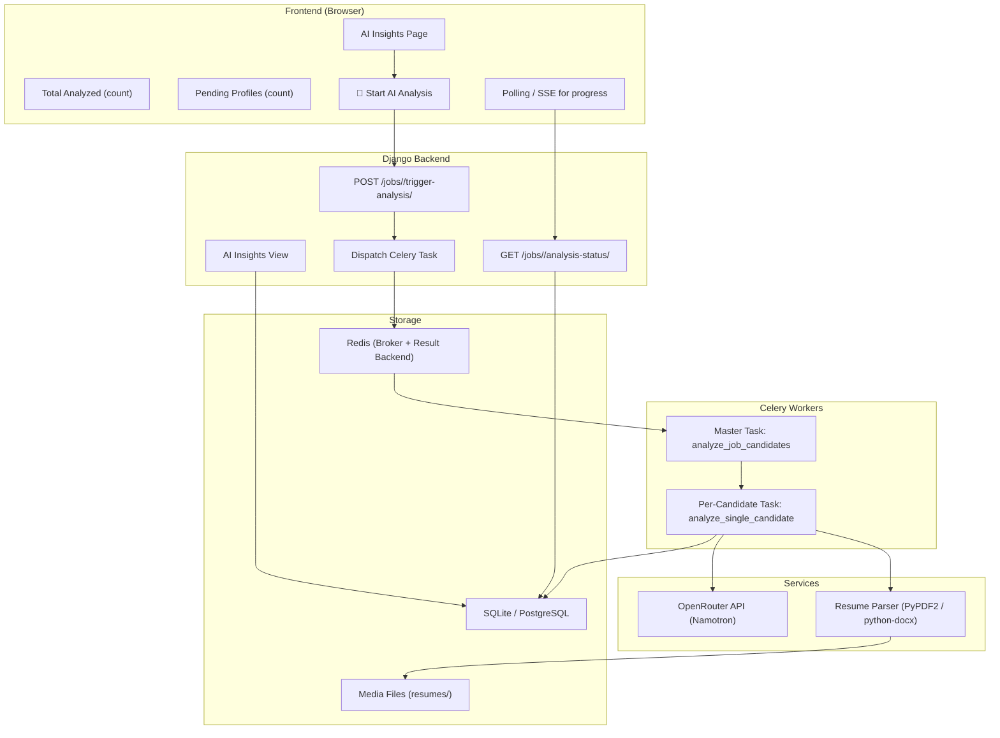
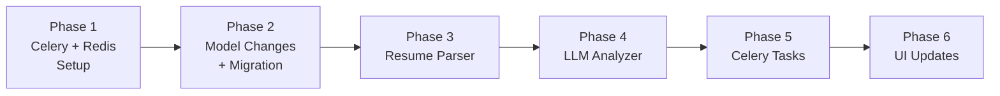

# 🧠 AI Resume Analysis System — Implementation Plan

## Overview

Build a **production-grade, async AI resume analysis pipeline** that:
1. Extracts text from uploaded resumes (PDF/DOCX)
2. Understands job requirements from the job description
3. Uses an LLM (Namotron via OpenRouter) to score and rank candidates
4. Stores detailed breakdown (skills match, experience, culture fit, strengths, gaps)
5. Runs in background via **Celery + Redis** for scalability
6. Shows real-time progress on the AI Insights page

---

## Current State Assessment

| Component | Status |
|-----------|--------|
| `Candidate.resume` | ✅ FileField exists, PDFs uploaded to `resumes/` |
| `Candidate.parsed_skills` | ✅ JSONField exists (currently empty) |
| `Candidate.summary` | ✅ TextField exists (currently empty) |
| `Application.ai_match_score` | ✅ IntegerField exists (currently **random mock**) |
| Resume parsing | ❌ No text extraction implemented |
| AI analysis | ❌ No LLM integration — all scores are `random.randint()` |
| Celery/Redis | ❌ Not installed or configured |
| Analysis tracking | ❌ No boolean/status fields to track analyzed vs pending |

---

## Architecture



---

## Key Questions Before We Start

> [!IMPORTANT]
> Please confirm these before I start coding:

### 1. LLM Provider
- You mentioned **Namotron via OpenRouter**. Please share:
  - The **API key** (I'll store it in `.env`, never committed)
  - The exact **model name** (e.g., `nvidia/nemotron-4-340b-instruct`)
  - Any preference on max tokens / temperature?

### 2. Resume Formats
- Currently I see PDF files in `resumes/`. Do you also expect **DOCX** files?
- Any other formats (plain text, images with OCR)?

### 3. Database
- You're on **SQLite** currently. For Celery + concurrent writes, **PostgreSQL is strongly recommended**. 
  - Do you want to stay on SQLite for now (with some concurrency caveats)?
  - Or migrate to PostgreSQL?

### 4. Redis Setup
- Do you have Redis installed on Windows? Options:
  - **WSL** — Run Redis inside WSL (recommended)
  - **Docker** — `docker run redis`  
  - **Memurai** — Windows-native Redis alternative
  - **Cloud** — Redis Labs free tier

### 5. Scale Expectations
- How many candidates per job typically? (10s? 100s? 1000s?)
- This affects whether we batch API calls or do them individually

### 6. Cost Controls
- LLM calls cost money. Should we add:
  - A confirmation prompt before starting analysis?
  - A daily/monthly usage cap?
  - Show estimated cost before running?

---

## Phased Implementation

---

### Phase 1: Infrastructure Setup (Celery + Redis)
**Goal:** Get async task infrastructure running

#### 1.1 Install Dependencies
```
pip install celery redis python-dotenv
```

#### 1.2 Create `core/celery.py`
```python
import os
from celery import Celery

os.environ.setdefault('DJANGO_SETTINGS_MODULE', 'core.settings')

app = Celery('core')
app.config_from_object('django.conf:settings', namespace='CELERY')
app.autodiscover_tasks()
```

#### 1.3 Add to `core/__init__.py`
```python
from .celery import app as celery_app
__all__ = ('celery_app',)
```

#### 1.4 Settings additions (`core/settings.py`)
```python
# Celery Configuration
CELERY_BROKER_URL = os.environ.get('REDIS_URL', 'redis://localhost:6379/0')
CELERY_RESULT_BACKEND = os.environ.get('REDIS_URL', 'redis://localhost:6379/0')
CELERY_ACCEPT_CONTENT = ['json']
CELERY_TASK_SERIALIZER = 'json'
CELERY_RESULT_SERIALIZER = 'json'

# OpenRouter
OPENROUTER_API_KEY = os.environ.get('OPENROUTER_API_KEY', '')
OPENROUTER_MODEL = os.environ.get('OPENROUTER_MODEL', 'nvidia/nemotron-4-340b-instruct')
```

#### 1.5 Create `.env` file
```
REDIS_URL=redis://localhost:6379/0
OPENROUTER_API_KEY=sk-or-xxxxx
OPENROUTER_MODEL=nvidia/nemotron-4-340b-instruct
```

**Deliverable:** `celery -A core worker --loglevel=info` starts successfully

---

### Phase 2: Data Model Changes
**Goal:** Track analysis state per application

#### 2.1 New fields on `Application` model

```python
class Application(models.Model):
    # ... existing fields ...
    
    # AI Analysis tracking
    ai_analysis_done = models.BooleanField(default=False)
    ai_analysis_started_at = models.DateTimeField(null=True, blank=True)
    ai_analysis_completed_at = models.DateTimeField(null=True, blank=True)
    ai_analysis_error = models.TextField(blank=True, null=True)
    
    # Detailed AI results (replaces dummy data)
    ai_skills_score = models.IntegerField(null=True, blank=True)
    ai_experience_score = models.IntegerField(null=True, blank=True)
    ai_culture_score = models.IntegerField(null=True, blank=True)
    ai_resume_score = models.IntegerField(null=True, blank=True)
    ai_matched_skills = models.JSONField(default=list, blank=True)
    ai_missing_skills = models.JSONField(default=list, blank=True)
    ai_strengths = models.JSONField(default=list, blank=True)
    ai_gaps = models.JSONField(default=list, blank=True)
    ai_recommendation = models.CharField(max_length=50, blank=True, null=True)
    ai_experience_years = models.IntegerField(null=True, blank=True)
    ai_culture_fit = models.CharField(max_length=20, blank=True, null=True)
    ai_summary = models.TextField(blank=True, null=True)
```

#### 2.2 New model for Job-level analysis tracking

```python
class JobAnalysisTask(models.Model):
    """Tracks a batch analysis run for a job."""
    STATUS_CHOICES = [
        ('PENDING', 'Pending'),
        ('PROCESSING', 'Processing'),
        ('COMPLETED', 'Completed'),
        ('FAILED', 'Failed'),
    ]
    
    id = models.UUIDField(primary_key=True, default=uuid.uuid4)
    job = models.ForeignKey(JobRequisition, on_delete=models.CASCADE, related_name='analysis_tasks')
    status = models.CharField(max_length=20, choices=STATUS_CHOICES, default='PENDING')
    celery_task_id = models.CharField(max_length=255, blank=True, null=True)
    total_profiles = models.IntegerField(default=0)
    processed_profiles = models.IntegerField(default=0)
    failed_profiles = models.IntegerField(default=0)
    started_at = models.DateTimeField(null=True, blank=True)
    completed_at = models.DateTimeField(null=True, blank=True)
    error_log = models.TextField(blank=True, null=True)
```

#### Why this design?
- `ai_analysis_done` on `Application` → instant filter for "analyzed vs pending"
- `JobAnalysisTask` → tracks the batch run progress (for the loading indicator)
- All scores stored on `Application` → no joins needed for the insights page

**Deliverable:** `python manage.py makemigrations && python manage.py migrate`

---

### Phase 3: Resume Text Extraction
**Goal:** Parse PDF/DOCX resumes into clean text

#### 3.1 Install parsers
```
pip install PyPDF2 python-docx
```

#### 3.2 Create `candidates/services/resume_parser.py`

```python
def extract_resume_text(file_path: str) -> str:
    """Extract text from PDF or DOCX resume files."""
    ext = file_path.lower().rsplit('.', 1)[-1]
    
    if ext == 'pdf':
        return _parse_pdf(file_path)
    elif ext in ('docx', 'doc'):
        return _parse_docx(file_path)
    elif ext == 'txt':
        return _parse_txt(file_path)
    else:
        raise ValueError(f"Unsupported file format: {ext}")

def _parse_pdf(path):
    from PyPDF2 import PdfReader
    reader = PdfReader(path)
    text = ""
    for page in reader.pages:
        text += page.extract_text() or ""
    return text.strip()

def _parse_docx(path):
    from docx import Document
    doc = Document(path)
    return "\n".join(p.text for p in doc.paragraphs).strip()

def _parse_txt(path):
    with open(path, 'r', encoding='utf-8') as f:
        return f.read().strip()
```

#### 3.3 Store extracted text on Candidate
- Add `resume_text = models.TextField(blank=True, null=True)` to `Candidate`
- Cache extracted text so we don't re-parse every time
- Only re-parse if `resume` file changes

**Deliverable:** Can call `extract_resume_text(candidate.resume.path)` and get clean text

---

### Phase 4: LLM Analysis Engine
**Goal:** Send job description + resume to OpenRouter, get structured scores

#### 4.1 Create `jobs/services/ai_analyzer.py`

```python
import requests
import json
from django.conf import settings

def analyze_candidate_for_job(job_description: str, resume_text: str, 
                                strictness: int = 80) -> dict:
    """
    Call OpenRouter LLM to analyze a candidate's resume against a job description.
    Returns structured scoring data.
    """
    
    system_prompt = """You are an expert AI recruiter analyzing resumes against job descriptions.
    Evaluate the candidate thoroughly and return a JSON object with these exact fields:
    
    {
        "overall_score": <int 0-100>,
        "skills_score": <int 0-100>,
        "experience_score": <int 0-100>,
        "culture_score": <int 0-100>,
        "resume_score": <int 0-100>,
        "matched_skills": ["skill1", "skill2", ...],
        "missing_skills": ["skill1", "skill2", ...],
        "strengths": ["strength1", "strength2", ...],
        "gaps": ["gap1", "gap2", ...],
        "recommendation": "Strong Hire" | "Hire" | "Review" | "Reject",
        "experience_years": <int>,
        "culture_fit": "High" | "Medium" | "Low",
        "summary": "2-3 sentence assessment"
    }
    
    Scoring criteria (strictness level: {strictness}/100):
    - Higher strictness = more exacting requirements matching
    - skills_score: How well candidate's skills match required skills
    - experience_score: Relevance and depth of experience
    - culture_score: Inferred cultural fit based on resume signals
    - resume_score: Quality, clarity, and professionalism of resume
    - overall_score: Weighted average of all dimensions
    
    Return ONLY valid JSON, no markdown, no explanation."""
    
    user_prompt = f"""
    === JOB DESCRIPTION ===
    {job_description}
    
    === CANDIDATE RESUME ===
    {resume_text}
    
    Analyze this candidate for the above job. Strictness level: {strictness}/100.
    Return the JSON scoring object."""
    
    response = requests.post(
        "https://openrouter.ai/api/v1/chat/completions",
        headers={
            "Authorization": f"Bearer {settings.OPENROUTER_API_KEY}",
            "Content-Type": "application/json",
        },
        json={
            "model": settings.OPENROUTER_MODEL,
            "messages": [
                {"role": "system", "content": system_prompt},
                {"role": "user", "content": user_prompt},
            ],
            "temperature": 0.3,
            "max_tokens": 1000,
            "response_format": {"type": "json_object"},
        },
        timeout=60,
    )
    
    response.raise_for_status()
    content = response.json()["choices"][0]["message"]["content"]
    return json.loads(content)
```

**Deliverable:** Can call `analyze_candidate_for_job(jd, resume)` and get real AI scores

---

### Phase 5: Celery Tasks
**Goal:** Orchestrate batch analysis in background workers

#### 5.1 Create `jobs/tasks.py`

```python
from celery import shared_task
from django.utils import timezone

@shared_task(bind=True, max_retries=2)
def analyze_single_application(self, application_id: str):
    """Analyze one candidate's resume against their job."""
    from candidates.models import Application
    from candidates.services.resume_parser import extract_resume_text
    from jobs.services.ai_analyzer import analyze_candidate_for_job
    
    app = Application.objects.select_related('candidate', 'job').get(id=application_id)
    
    try:
        # 1. Extract resume text (with caching)
        candidate = app.candidate
        if not candidate.resume:
            raise ValueError("No resume uploaded")
        
        resume_text = extract_resume_text(candidate.resume.path)
        if not resume_text.strip():
            raise ValueError("Resume text is empty after extraction")
        
        # Cache on candidate
        candidate.resume_text = resume_text[:50000]  # Truncate for safety
        candidate.save(update_fields=['resume_text'])
        
        # 2. Run LLM analysis
        result = analyze_candidate_for_job(
            job_description=app.job.description,
            resume_text=resume_text[:10000],  # LLM context limit
            strictness=app.job.ai_parsing_strictness
        )
        
        # 3. Save results
        app.ai_match_score = result.get('overall_score', 0)
        app.ai_skills_score = result.get('skills_score', 0)
        app.ai_experience_score = result.get('experience_score', 0)
        app.ai_culture_score = result.get('culture_score', 0)
        app.ai_resume_score = result.get('resume_score', 0)
        app.ai_matched_skills = result.get('matched_skills', [])
        app.ai_missing_skills = result.get('missing_skills', [])
        app.ai_strengths = result.get('strengths', [])
        app.ai_gaps = result.get('gaps', [])
        app.ai_recommendation = result.get('recommendation', 'Review')
        app.ai_experience_years = result.get('experience_years', 0)
        app.ai_culture_fit = result.get('culture_fit', 'Medium')
        app.ai_summary = result.get('summary', '')
        app.ai_analysis_done = True
        app.ai_analysis_completed_at = timezone.now()
        app.ai_analysis_error = None
        app.save()
        
        return {'status': 'success', 'application_id': str(app.id)}
        
    except Exception as exc:
        app.ai_analysis_error = str(exc)
        app.save(update_fields=['ai_analysis_error'])
        raise self.retry(exc=exc, countdown=30)


@shared_task
def analyze_job_candidates(job_id: str, task_tracker_id: str):
    """Master task: Dispatch analysis for all pending candidates in a job."""
    from candidates.models import Application
    from .models import JobAnalysisTask
    
    tracker = JobAnalysisTask.objects.get(id=task_tracker_id)
    tracker.status = 'PROCESSING'
    tracker.started_at = timezone.now()
    tracker.save()
    
    pending_apps = Application.objects.filter(
        job_id=job_id,
        ai_analysis_done=False,
        candidate__resume__isnull=False,  # Must have a resume
    ).exclude(candidate__resume='')
    
    tracker.total_profiles = pending_apps.count()
    tracker.save(update_fields=['total_profiles'])
    
    for app in pending_apps:
        try:
            analyze_single_application.delay(str(app.id))
        except Exception as e:
            tracker.failed_profiles += 1
            tracker.save(update_fields=['failed_profiles'])
    
    # Note: Completion is tracked by polling individual Application statuses
```

**Deliverable:** `analyze_job_candidates.delay(job_id, tracker_id)` kicks off batch processing

---

### Phase 6: UI — AI Insights Page Update
**Goal:** Add the 3 buttons + real-time progress

#### 6.1 Three Header Buttons

```
┌──────────────────────────────────────────────────────────────────┐
│  ← Back to Pipeline  /  🧠 AI Insights & Rankings               │
│                                                                  │
│  ┌────────────────┐  ┌────────────────┐  ┌────────────────────┐  │
│  │ ✅ Total: 7    │  │ ⏳ Pending: 3  │  │ 🚀 Start Analysis │  │
│  │   Analyzed     │  │   Profiles     │  │   (3 remaining)   │  │
│  └────────────────┘  └────────────────┘  └────────────────────┘  │
│                                                                  │
│  ┌─ Loading Bar (when processing) ──────────────── 4/7 ─────┐  │
│  │ ████████████████████░░░░░░░░░░░░░░░░░░ 57% Processing... │  │
│  └──────────────────────────────────────────────────────────┘  │
└──────────────────────────────────────────────────────────────────┘
```

#### 6.2 API Endpoints needed

| Endpoint | Method | Purpose |
|----------|--------|---------|
| `/jobs/<id>/trigger-analysis/` | POST | Start batch analysis (creates Celery task) |
| `/jobs/<id>/analysis-status/` | GET | Returns JSON: `{total, analyzed, pending, is_processing, progress_pct}` |

#### 6.3 Frontend Polling

```javascript
// Poll every 3 seconds while processing
let analysisPoller = null;

function startPolling(jobId) {
    analysisPoller = setInterval(async () => {
        const res = await fetch(`/jobs/${jobId}/analysis-status/`);
        const data = await res.json();
        
        updateCounters(data.analyzed, data.pending);
        updateProgressBar(data.progress_pct);
        
        if (!data.is_processing) {
            clearInterval(analysisPoller);
            location.reload();  // Refresh to show new scores
        }
    }, 3000);
}
```

#### 6.4 Modified `ai_insights` View

```python
def ai_insights(request, pk):
    job = get_object_or_404(JobRequisition, pk=pk, ...)
    applications = job.applications.select_related('candidate').all()
    
    analyzed_apps = [a for a in applications if a.ai_analysis_done]
    pending_apps = [a for a in applications if not a.ai_analysis_done]
    
    # Build insights from REAL data (not random!)
    insights = []
    for app in analyzed_apps:
        insights.append({
            'application': app,
            'candidate': app.candidate,
            'overall_score': app.ai_match_score or 0,
            'skills_score': app.ai_skills_score or 0,
            'experience_score': app.ai_experience_score or 0,
            'culture_score': app.ai_culture_score or 0,
            'resume_score': app.ai_resume_score or 0,
            'matched_skills': app.ai_matched_skills or [],
            'missing_skills': app.ai_missing_skills or [],
            'strengths': app.ai_strengths or [],
            'gaps': app.ai_gaps or [],
            'recommendation': app.ai_recommendation or 'Pending',
            'experience_years': app.ai_experience_years or 0,
            'culture_fit': app.ai_culture_fit or 'N/A',
        })
    
    insights.sort(key=lambda x: x['overall_score'], reverse=True)
    for i, item in enumerate(insights):
        item['rank'] = i + 1
    
    # Check if analysis is currently running
    active_task = job.analysis_tasks.filter(status='PROCESSING').first()
    
    return render(request, 'jobs/ai_insights.html', {
        'job': job,
        'insights': insights,
        'total_candidates': applications.count(),
        'analyzed_count': len(analyzed_apps),
        'pending_count': len(pending_apps),
        'is_processing': active_task is not None,
        'active_task': active_task,
    })
```

---

## File Changes Summary

| File | Action | Description |
|------|--------|-------------|
| `requirements.txt` | MODIFY | Add `celery`, `redis`, `python-dotenv`, `PyPDF2`, `python-docx` |
| `.env` | CREATE | API keys, Redis URL |
| `core/celery.py` | CREATE | Celery app configuration |
| `core/__init__.py` | MODIFY | Import celery app |
| `core/settings.py` | MODIFY | Add Celery + OpenRouter settings |
| `candidates/models.py` | MODIFY | Add `resume_text` to Candidate; add analysis fields to Application; add `JobAnalysisTask` model |
| `candidates/services/resume_parser.py` | CREATE | PDF/DOCX text extraction |
| `jobs/services/ai_analyzer.py` | CREATE | OpenRouter LLM integration |
| `jobs/tasks.py` | CREATE | Celery tasks for batch analysis |
| `jobs/views.py` | MODIFY | Update `ai_insights` view, add trigger/status endpoints |
| `jobs/urls.py` | MODIFY | Add new API routes |
| `jobs/templates/jobs/ai_insights.html` | MODIFY | Add 3 buttons, progress bar, real data |

---

## Execution Order



> [!TIP]
> We can start Phase 1-3 immediately without the API key. Phase 4 onward needs the OpenRouter credentials.

---

## Risk Mitigation

| Risk | Mitigation |
|------|-----------|
| SQLite + Celery concurrency | Use `timeout=10` (already set), consider PostgreSQL for production |
| LLM returns invalid JSON | Retry with `max_retries=2`, fallback to regex parsing |
| Large resumes exceed context | Truncate to 10K chars, extract key sections first |
| API rate limits | Add `countdown` delay between tasks, use `rate_limit='5/m'` on Celery task |
| Cost runaway | Add confirmation before analysis, track token usage |
| Resume not uploaded | Skip gracefully, show "No Resume" in pending list |

---

## Ready to Start?

> [!IMPORTANT]
> Before I begin coding, please confirm:
> 1. ✅ or ❌ — The plan looks good overall?
> 2. Your **OpenRouter API key** (I'll put it in `.env`)
> 3. The **exact model name** on OpenRouter for Namotron
> 4. How you want to run **Redis** (WSL / Docker / Memurai / Cloud)?
> 5. Stay on **SQLite** or migrate to **PostgreSQL**?
