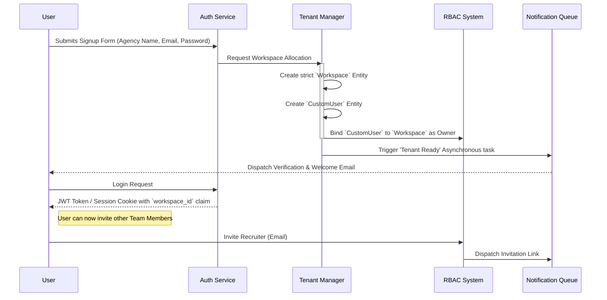

# Automated Tenant & Team Provisioning Workflow

The Tenant Provisioning workflow is the foundational entry point into NexATS. Because all data is heavily partitioned by workspaces, setting up the tenant correctly is required before any hiring can occur.

## Architectural Flow

## Detailed Explanation

1. **Origin of Isolation (The Workspace):** When an agency initially signs up, the very first database query creates a `Workspace` record. This guarantees that an isolated logical bucket exists.
2. **Owner Binding:** The user is generated and explicitly given the "Owner" flag within the Role-Based Access Control (RBAC) component, and hard-linked to the new `workspace_id`.
3. **Session Awareness:** When this user logs in, their session or token natively encrypts the `workspace_id`. Every single subsequent database query in the ATS automatically intercepts this token and pre-filters `WHERE workspace_id = X`.
4. **Team Invites:** The owner can utilize their permissions to generate invites for other "Team Members" (e.g., specific headhunters or recruiters). Because the Owner generated the invite, the invited users are automatically bound to the exact same partition space when they register.
