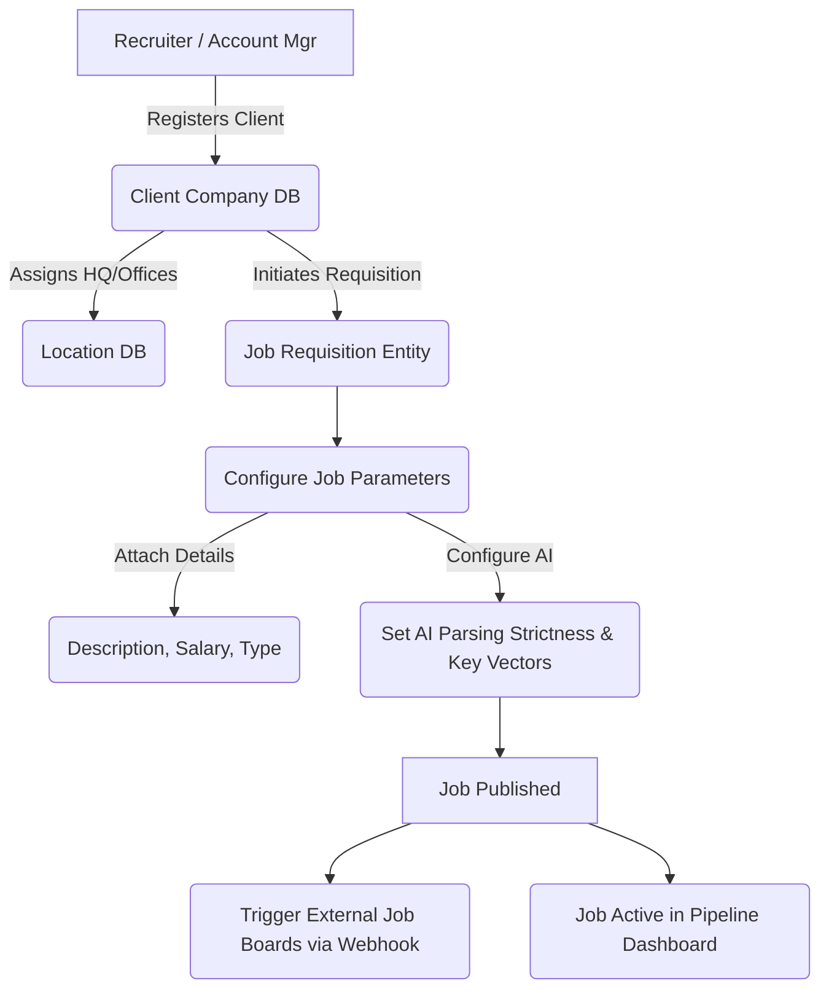

# Client Company & Job Creation Workflow

This workflow tracks how an agency translates a hiring request from their external client into an active, AI-monitored Job Requisition inside the ATS.

## Architectural Flow

## Detailed Explanation

1. **Client & Location Provisioning:** Unlike internal corporate ATS systems, an agency ATS requires you to declare *who* you are hiring for. The recruiter defines `Acme Corp` and registers their locations. This limits job creation parameters geographically and applies specific corporate branding (Client logo) to the workflow.
2. **Requisition Definition:** The core Job document is drafted. This involves standard fields (Salary, Seniority, Description).
3. **AI Rule Configuration:** This is unique to NexATS. During the job setup, the recruiter configures the "AI Lens". They specify exactly what skills are non-negotiable vectors versus nice-to-haves. This establishes the numerical thresholds that the AI Engine will use later when parsing thousands of resumes.
4. **Publishing & Syndication:** Upon publishing, the state changes to `Active`. This opens up an Application URL and optionally fires Webhooks to syndicate the job out to external career boards, making it heavily automated.
