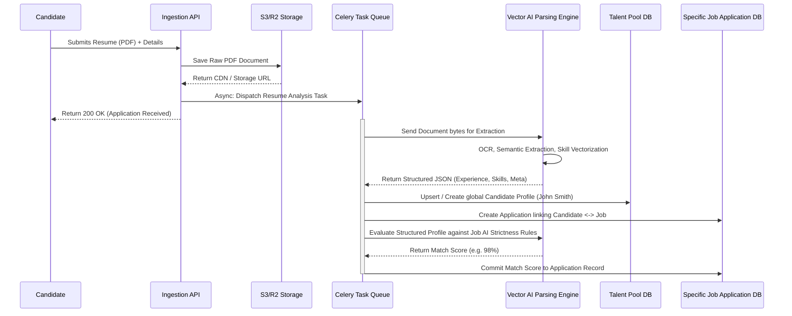

# Candidate Ingestion & AI Parsing Workflow

This is the most compute-heavy and complex workflow in NexATS. It dictates how raw PDFs/documents submitted by candidates are systematically transformed into actionable, scored datasets within the database.

## Architectural Flow

## Detailed Explanation

1. **Decoupled Uploads:** When a candidate uploads a resume, the system must not block or freeze waiting for the AI. The document is immediately dumped to a Cloud Storage bucket, and a rapid acknowledgment is sent to the candidate.
2. **Asynchronous Processing (Celery):** The ATS relies on a robust Celery worker queue. The heavy lifting is handed off via a background task. 
3. **AI Extraction Phase:** The engine parses the PDF, ignoring formatting biases, and extracting raw chronological facts, educational history, and implicit skill vectors using Natural Language Processing.
4. **Global Talent Creation:** The extracted data is constructed into an agnostic Candidate JSON profile, which gets cached in the Global Talent Pool database for the agency.
5. **Conditional Scoring:** Finally, the structured candidate profile is mathematically compared against the specific ruleset configured in the `Job Requisition`. A strict match score is plotted and permanently assigned to their active `Application` record, immediately slotting them into the recruiter's Kanban board.
