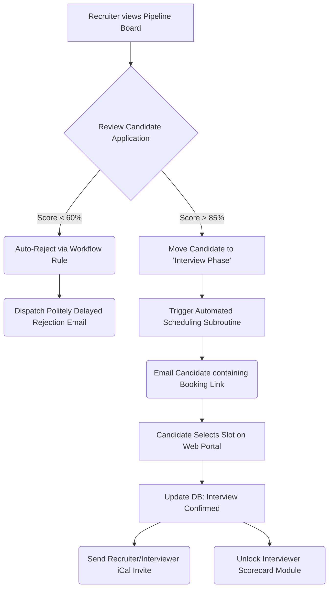

# Pipeline Progression & Interview Scheduling Workflow

This workflow represents the interactive "Action phase" handled by human recruiters once the AI has surfaced top-tier candidates on the Kanban board.

## Architectural Flow

## Detailed Explanation

1. **Pipeline Triggers:** As candidates are processed, they populate the Kanban board (as seen in the styling of `ref/dashboard.html`). Moving a candidate card from "Sourced" to "Rejected" or "Interviewing" conceptually acts as a trigger to execute database state-changes and background tasks.
2. **Automated Rejections (Ghosting Prevention):** By leveraging workflow rules, low-score candidates can be auto-rejected. To simulate human delay, the rejection email might be thrown into a Celery task set to delay execution by 48 hours.
3. **Zero-Touch Scheduling:** Instead of playing email ping-pong, migrating a candidate to an "Interview Phase" instructs the system to instantly generate a one-time booking link keyed to the assigned Interviewer's synced calendar availability.
4. **Scorecard Execution:** When the candidate successfully books a slot, the system finalizes the record. At the exact time of the interview, the interviewer is prompted with a localized dashboard module specifically generated to evaluate that candidate based purely on the defined Job criteria, closing the assessment loop.
