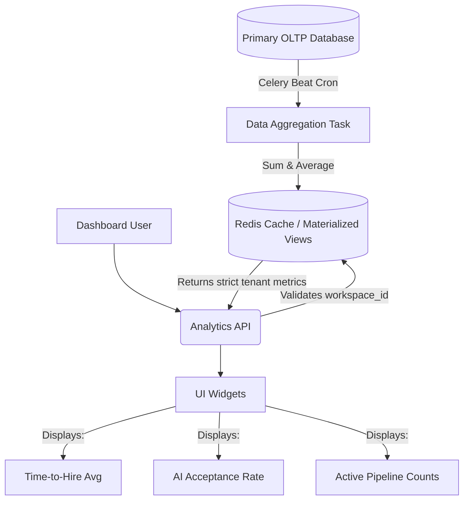

# Analytics & Reporting Architecture

A core value proposition for recruitment agencies is proving ROI to their clients. NexATS must securely aggregate data from various jobs and present it cleanly on the dashboard without exposing any protected data.

## Architectural Flow

## Detailed Explanation

1. **OLTP vs. OLAP Separation Concept:** Calculating complex business metrics (like average time-to-hire across 50,000 candidates) inside PostgreSQL at the time of a user's page load forces dashboards to load slowly. 
2. **Celery Beat Aggregation:** Instead, a scheduled task (`celery-beat`) runs daily (or hourly) across the database. It compiles metrics strictly grouped by `workspace_id`.
3. **Caching Layer:** The resulting JSON payloads or pre-compiled tables are stored in Redis or Materialized Views.
4. **Tenant-Safe Querying:** When a user logs in and loads `dashboard.html`, the API requests these cached statistics. The API layer forcefully injects the user's implicit `workspace_id`, ensuring it is computationally impossible to query metrics belonging to a rival agency.
