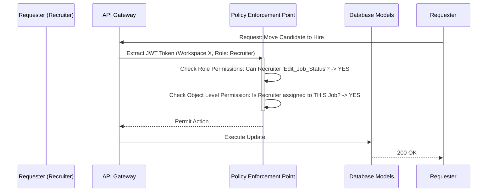

# Role-Based Access Control (RBAC) Architecture

In an agency setting, maintaining the principle of least privilege is mandatory. An external junior recruiter shouldn't have access to executive compensation details or client billing data.

## Architectural Flow

## Detailed Explanation

The NexATS RBAC system operates dynamically on two intersecting levels:
1. **Vertical Roles:** Global permissions (e.g., `Admin`, `Hiring Manager`, `Interviewer`). An `Interviewer` cannot delete a job. An `Admin` can do anything.
2. **Horizontal Object-Level Permissions:** Even if a user has the `Hiring Manager` role, they might only be explicitly assigned to the `Acme Corp` client branch. If they try to access candidate data for a job listed under `Globex Corp`, the RBAC engine yields a `403 Forbidden` error. This multi-axis security makes the platform enterprise-ready and compliant with data privacy frameworks.
