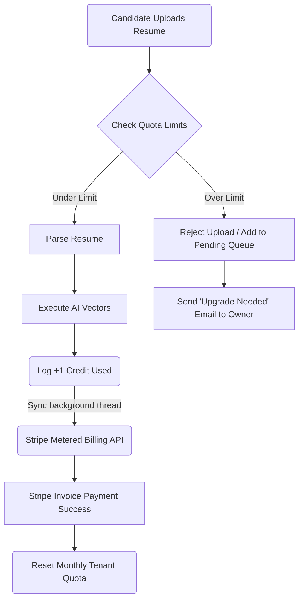

# Billing, Stripe Usage, & Quota Enforcement

AI integration is not free—every time NexATS parses a PDF or calculates vector scores, server costs are incurred. The system must track usage per workspace to enforce billing tiers and prevent abuse.

## Architectural Flow

## Detailed Explanation

1. **Credit Allocation:** Workspaces buy into different tiers (e.g., *Pro Plan* gets 500 AI Parses/month).
2. **Metered Execution:** Centralizing AI requests through a single service class acts as a choke point. Before attempting to parse a document, the class verifies the `Workspace.credits_remaining`.
3. **Stripe Syncing:** Every successful parsing event decrements a credit locally and increments a usage meter on Stripe via an asynchronous job. 
4. **Resiliency:** If an agency is suddenly swarmed with 10,000 applications causing them to run out of credits, the system does not lose data. Rather than dropping candidates, it dumps them into a `Pending Raw Uploads` queue and emails the workspace owner to upgrade their tier. Resumes remain safely untouched until billing is resolved.
