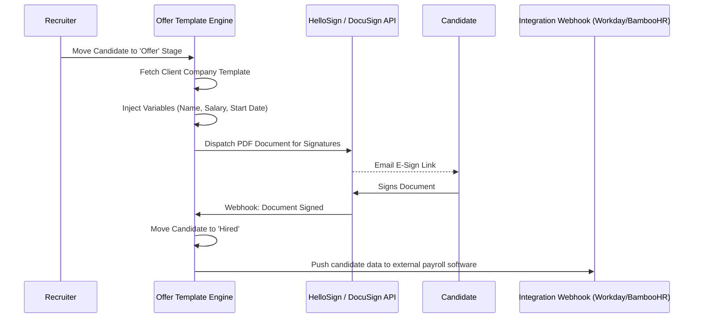

# Offer Generation & Onboarding Workflow

The ultimate goal of the ATS pipeline is an accepted offer letter. This workflow covers the legally-binding sign-off stage, ensuring an agency cleanly ends its recruitment responsibility.

## Architectural Flow

## Detailed Explanation

This loop sits at the very end of the Kanban board:
1. **Dynamic Templating:** Instead of manually typing letters, moving a candidate card to the `Offer Stage` pulls a base document template previously assigned to that specific `Client Company`. Using Jinja-style logic, the engine injects variables (`{{ candidate.name }}`) mapped from the database.
2. **eSignature API integrations:** The compiled PDF is securely piped out to third-party signature handlers, taking away the pain of manual tracking.
3. **Webhooks and State Modification:** Once the signature provider pings the NexATS webhook endpoint acknowledging a successful execution, the ATS autonomously reclassifies the application as `Hired` and broadcasts the new hire's data to external HRIS platforms via an outbound integration payload.
